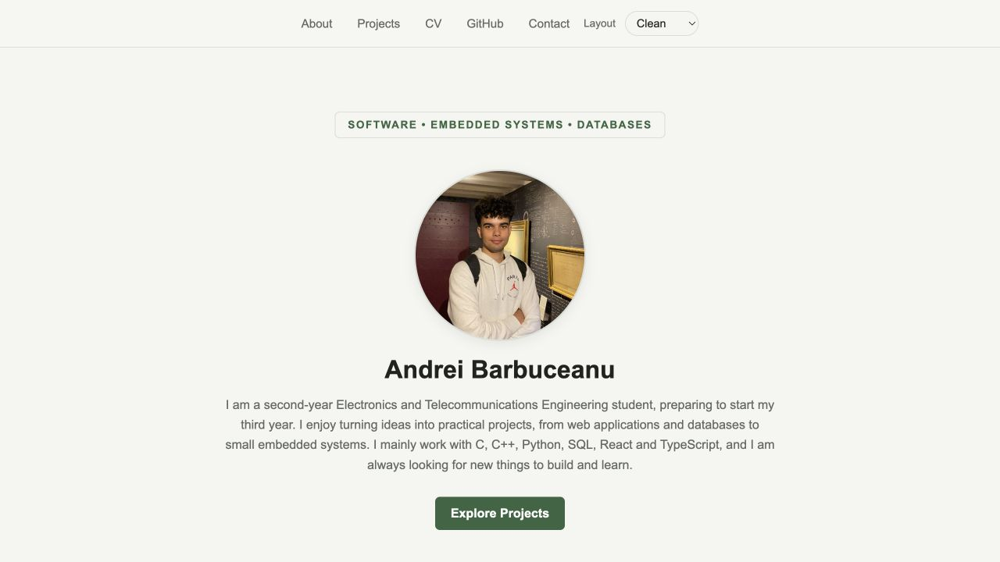
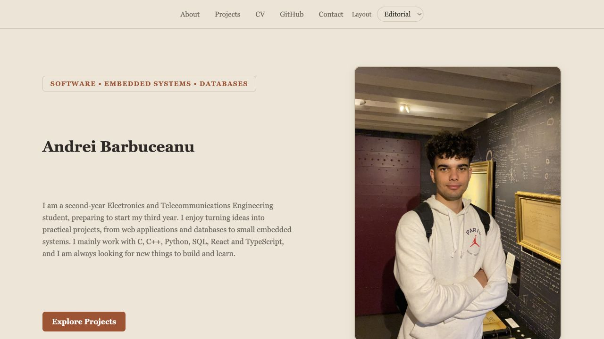
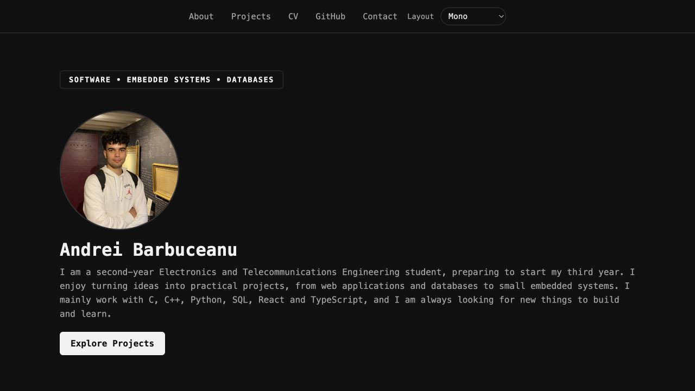

# Personal Portfolio

A responsive personal portfolio built with React, TypeScript and Vite. The site presents my projects, achievements, CV, recent GitHub activity and contact information.

## Live Demo

[View the portfolio](https://andreibarbuceanu.github.io/personal-portfolio/)

## Screenshots

### Clean



### Editorial



### Mono



## Features

- Responsive layout for desktop and mobile
- Three selectable themes: Clean, Editorial and Mono
- Theme preference saved in `localStorage`
- Project cards with detailed modals
- Achievements carousel with automatic navigation
- Downloadable CV
- Recent activity loaded from the GitHub API
- Cached GitHub activity when the API is unavailable
- Keyboard-accessible cards and modals

## Technologies

- React
- TypeScript
- Vite
- CSS
- GitHub REST API
- GitHub Pages

## Project Structure

```text
src/
  assets/              Profile image
  components/
    layout/            Navbar and theme switcher
    sections/          Portfolio page sections
  data/                Projects and achievements
  App.tsx               Main page structure
  index.css             Global styles and theme variables

public/
  cv/                   Downloadable CV
```

## Getting Started

Clone the repository and install the dependencies:

```bash
git clone https://github.com/andreibarbuceanu/personal-portfolio.git
cd personal-portfolio
npm install
```

Start the development server:

```bash
npm run dev
```

## Available Commands

```bash
npm run dev       # Start the development server
npm run build     # Create a production build
npm run lint      # Check the code with ESLint
npm run preview   # Preview the production build locally
npm run deploy    # Deploy the dist folder to GitHub Pages
```

## Deployment

The project is configured for GitHub Pages. Before deploying, the `predeploy` script creates a fresh production build automatically.
