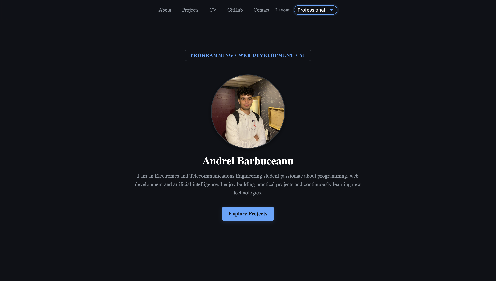
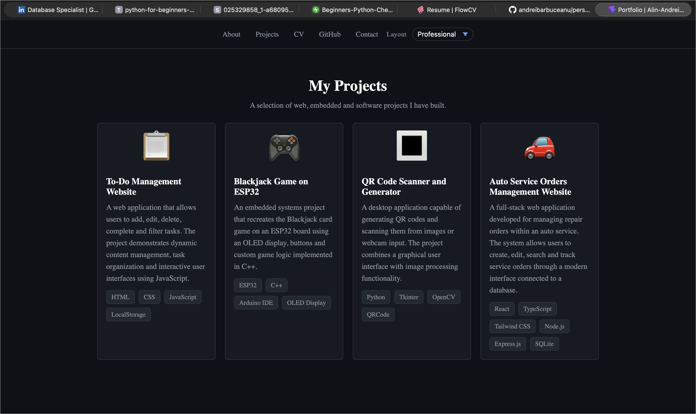
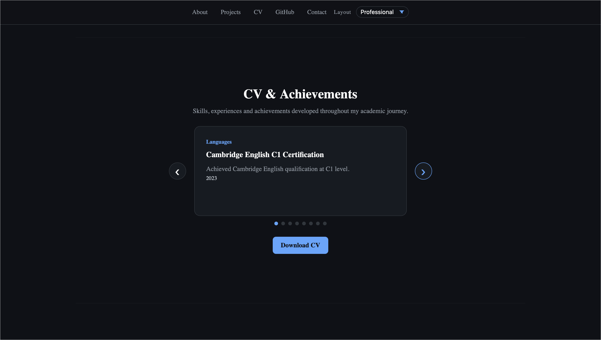
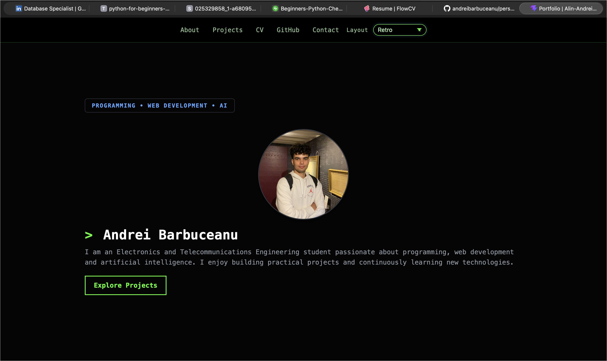

# Personal Portfolio

This is my personal portfolio website, built with React, TypeScript, and Vite. It presents my software projects, technical skills, certifications, CV, GitHub activity, and contact information.

## Live Demo

https://andreibarbuceanu.github.io/personal-portfolio/

## Screenshots









## Features

- Responsive interface
- Multiple layout themes
- Project showcase
- Downloadable CV
- Certifications and achievements
- GitHub activity
- Contact section

## Technologies

- React
- TypeScript
- Vite
- CSS
- GitHub Pages

## Project Structure

```text
src/
  assets/              Images and other local assets
  components/
    layout/            Navigation and layout switcher
    sections/          Portfolio page sections
  data/                Project and achievement data
screenshots/           Portfolio screenshots
```

## Getting Started

```bash
git clone https://github.com/andreibarbuceanu/personal-portfolio.git
cd personal-portfolio
npm install
npm run dev
```

## Projects

- **Task Management Web Application** — HTML, CSS, JavaScript, LocalStorage
- **Blackjack Game on ESP32** — ESP32, C++, Arduino IDE, OLED Display
- **QR Code Generator & Scanner** — Python, Tkinter, OpenCV, QRCode, SMTP
- **Automotive Service Management Web Application** — React, TypeScript, Node.js, Express.js, MySQL, REST API
- **Personal Portfolio Website** — React, TypeScript, Vite, GitHub API, LocalStorage, GitHub Pages
- **Inductive Metal Detector** — Analog Electronics, Operational Amplifiers, Circuit Design, Signal Analysis

## Future Improvements

- Improve accessibility
- Add more project case studies
- Improve performance
- Refine the design
